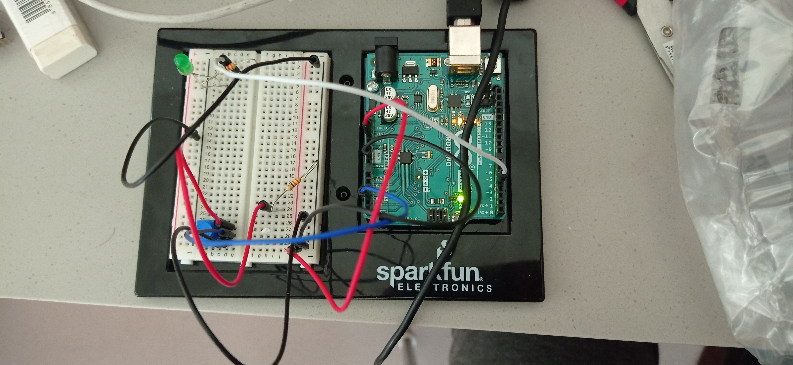
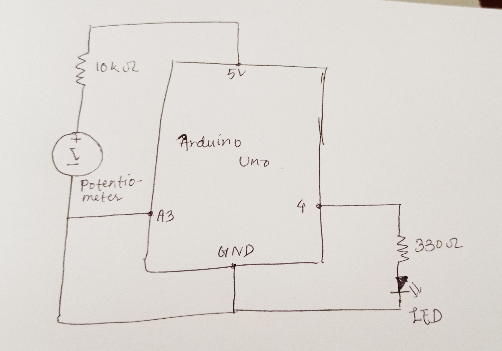

# 1.  Ellipse Movement through Potentiometer, Blinking LED through keyboard, and The Ball Roller

## Concepts

As discussed in the homework assignment, we had to make use of serial communication and complete certain tasks. My project included:
- an ellipse sketch in Processing that moved with the turning of the Potentiometer through Arduino
- an LED that goes on or off when certain keys in the keyoard are pressed
- a bouncing ball in Processing that with each bounce, made the LED turn on and could be moved to the left or the right through the potentiometer 

## Application

I took a simple circuit consisting of an LED, a 330 Ohm resistor, some wires, a 10K Ohm resistor and a potentiometer (as shown in the schematic below). I used the circuit for all of the conncepts mentioned above. 

## Issues

Although the first two concepts were quite doable, I had an issue with making the LED glow right as the ball touches the floor and turn off right when the ball left the floor. For that, I went into Aaron's code and saw how he'd organized it. I had never used the PVector in my own projects before so it was challenging to understand the concept. After I learned about it, I looked at how Aaron had defined the code for the y-position and the radius of the ball. I made it so that when the (y-position - radius) was equal to the height of the screen, the LED would go on but if it wasn't equal to the height of the screen, the LED would stay off. It took some time and some attention to figure this out though the concept seems fairly simple.

# 2.  Final Project Concept

I want to continue with my Tic-Tac-Toe that I built for my Mid-Term. However, I want to make it so that the turning of the potentiometer selects the box in which the 'Tic-Tac' or the 'Toe' is to be placed and blocking light from the LDR places the 'Tic-Tac' or the 'Toe'. And, every time a Tic-Tac is placed, a blue LED glows for some time and every time a Toe is placed, a yellow LED glows for some time. Similarly, in case anyone wins, a Green LED glows, a blue led (if Tic-Tac wins) or a yellow LED (if Toe wins) blinks, and a victory sound effect is played through the Buzzer. In case of a draw, a red LED fades in and out.
